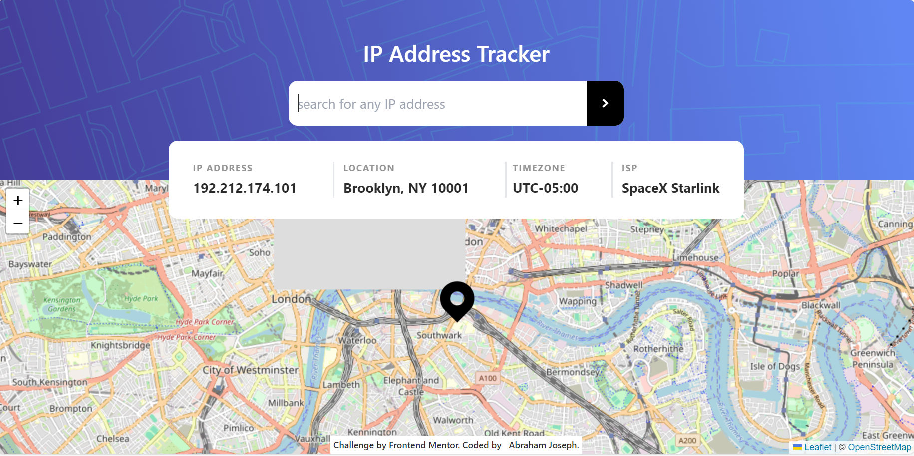

# Frontend Mentor - IP address tracker solution

## Table of contents

- [Overview](#overview)
  - [The challenge](#the-challenge)
  - [Screenshot](#screenshot)
  - [Links](#links)
- [My process](#my-process)
  - [Built with](#built-with)
  - [What I learned](#what-i-learned)
  - [Useful resources](#useful-resources)
- [Author](#author)

## Overview

### The challenge

Users should be able to:

- View the optimal layout for each page depending on their device's screen size
- See hover states for all interactive elements on the page
- See their own IP address on the map on the initial page load
- Search for any IP addresses or domains and see the key information and location

### Screenshot

### Links

- Live Site URL: [Add live site URL here](https://your-live-site-url.com)

## My process

### Built with

- Semantic HTML5 markup
- TailwindCSS
- Vanilla JavaScript

### What I learned

The whole process of interacting with API and fetching data is alot more fun than I assumed, but i have alot of learning to do on API environment.

## Author

- Frontend Mentor - [@abteck](https://www.frontendmentor.io/profile/abteck)
- Twitter - [@abteck2](https://www.twitter.com/abteck2)
